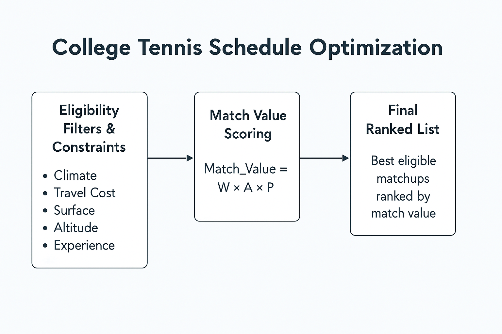

## A Smarter Way to Schedule

To address the growing complexity of NCAA tennis scheduling, I designed a **linear optimization model** that helps coaches build better match schedules — balancing performance potential, cost, and fairness.

This model turns a coach’s manual puzzle into a data-driven, adaptable system.

---

## 🎯 Objective

**Maximize total projected ITA ranking points**  
...while satisfying constraints related to travel, match type, and opponent tier.

---

## 🧠 How It Works

The model uses a linear programming formulation that optimizes matchups based on a school’s preferences, availability, and budget.

### Inputs:
- Team rank, location, and travel budget
- Opponent pool (rank 1–75, plus tiers 76–125 and unranked)
- Climate preferences (e.g. indoor-only, warm-weather preference)
- Conference restrictions and game caps

### Objective Function:
Maximize:
Σ (Match_Value) = Σ [W x A x P]

W is the win point value based on opponent's ITA rank.

A is the away bonus multiplier.

P is the estimated probability of winning the match.

#### Step 1: Win Points(W)

Each match win is worth a certain number of ITA ranking points based on the opponent's rank:

- Beat #1: 106 pts
- Beat #25: 60 pts
- Beat #75: 20 pts

Therefore, we can say that `W = ITA_Points(Opponent_Rank)`

#### Step 2: Away Match Bonus (A)

The ITA gives the away team a 10% bonus for a win:

`A = 1.1 if match is away`
`A = 1.0 if match is home`

#### Step 3: Win Probability (P)

A team's chance of winning is estimated based on the rank gap:

`P = min(1.0, max(0.0, 1 - (Team_Rank - Opponent_Rank) x 0.02))`

This algorithm ensures that the values cannot be less than 0.0 or greater than 1.0. 
If the ranking differences between the teams are large the value is clamped to either 0.0 or 1.0.
A 2% scaling factor means that for every 1-place difference in rank, the probability drops by 2%. A 2% per rank means that a 25-spot difference means a 50% win chance, a 50-spot difference means a 0% win chance because the value is clamped. 
This allows for small gaps to still give both teams a chance where larger gaps discourage unfair matchups.

---

### 📊 Match Value Examples

Here are sample matchups with expected ranking value outputs based on the model:

| Team Rank | Opponent Rank | Win Prob (P) | ITA Points (W) | Away? | Bonus (A) | Match Value |
|-----------|----------------|--------------|----------------|-------|------------|--------------|
| 40        | 70             | 1.0          | 20             | Yes   | 1.1        | 22.0         |
| 40        | 30             | 0.8          | 60             | No    | 1.0        | 48.0         |
| 40        | 1              | 0.22         | 106            | Yes   | 1.1        | 25.63        |
| 40        | 45             | 1.0          | 40             | No    | 1.0        | 40.0         |
| 40        | 100            | 1.0          | 10             | Yes   | 1.1        | 11.0         |
| 40        | 0              | 0.2          | 106            | No    | 1.0        | 21.2         |

---

**Interpretation:**

- Higher match value means a **strategically beneficial match**.
- Good value arises when:
  - You have a **real chance of winning**
  - The opponent is **ranked well enough** to earn ITA points
  - The match is **on the road**, adding a bonus multiplier

---

### Constraints:

| Constraint Type       | Example Description                                          |
|-----------------------|--------------------------------------------------------------|
| Ranked Match Limit    | Max 7 non-conference matches per team                        |
| Travel Budget         | School-specific travel caps (e.g. $5,000 limit)              |
| Climate Filtering     | Northern teams avoid cold-weather early matches             |
| Ranking Tier Filter   | Coach selects preferred range (e.g. 21–75)                   |
| Home/Away Split       | Balanced number of home vs away matches                      |
| Fairness Rules        | Conference-specific (e.g. WCC no shared travel partners)     |

---

### 🧠 Optimization Workflow

---

## 🔍 Future Integration with Palantir Foundry

This model is designed to plug into a full decision intelligence platform like **Palantir Foundry**, where we can:

- Ingest real NCAA data
- Model dynamic travel costs with geospatial tools
- Visualize optimized schedules in coach dashboards
- Simulate different scenarios (e.g. early conference start, weather alerts)

---

